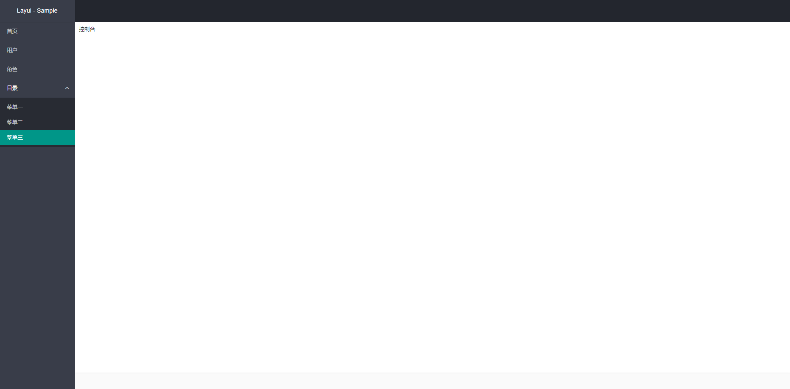

<br>



<br>
<br>

layui 之所以赢得如此多人的青睐，更多是在于它「前后界面兼备」的能力。既可编织出绚丽的前台页面，又可满足繁杂的管理系统界面需求。layui 致力于让每一位开发者都能轻松搭建自己的管理界面。下面是演示代码 :

<br>

```html
<lay-layout>
  <lay-header>
    <lay-logo>Layui Admin</lay-logo>
  </lay-header>
  <lay-side></lay-side>
  <lay-body>
    <router-view></router-view>
  </lay-body>
  <lay-footer>pearadmin.com</lay-footer>
</lay-layout>
```

::: field layout components

:::

|            |      |     |
| ---------- | ---- | --- |
| lay-layout | 容器 | --  |
| lay-header | 顶部 | --  |
| lay-logo   | 图标 | --  |
| lay-side   | 侧边 | --  |
| lay-body   | 内容 | --  |
| lay-footer | 底部 | --  |
